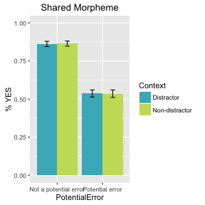

# Basic information about data

Results from first 19 subjects are in results.first19 -- these were done before Roger had implemented recording of the results code.  Fortunately, at least 18 of these participants are self-reported native English speakers.

Lucky Eagle 5-16 were run starting just after 11am Eastern on Friday, August 5, 2016.  For this batch, use the following commands to generate results to be analyzed:

    egrep hiddenCompletionCode results > completionCodes
    egrep -v hiddenCompletionCode results > results-by-trial
    
# Results


```
## Loading required package: Matrix
```

```
## Loading required package: methods
```

```
## Warning: package 'ggplot2' was built under R version 3.2.4
```

```
## 
## Attaching package: 'dplyr'
```

```
## The following objects are masked from 'package:data.table':
## 
##     between, last
```

```
## The following object is masked from 'package:stats':
## 
##     filter
```

```
## The following objects are masked from 'package:base':
## 
##     intersect, setdiff, setequal, union
```

Some basic information -- we have good coverage of each item-condition combination:


```r
# check response rates
with(dat,tapply(Item,list(Item,Type),length))
```

```
##     control.error control.target distractor.error distractor.target
## 1              25             29               22                30
## 2              30             25               29                22
## 3              22             30               25                29
## 4              29             22               30                25
## 5              25             29               22                30
## 6              30             25               29                22
## 7              22             30               25                29
## 8              29             22               30                25
## 9              25             29               22                30
## 10             30             25               29                22
## 11             22             30               25                29
## 12             29             22               30                25
## 13             25             29               22                30
## 14             30             25               29                22
## 15             22             30               25                29
## 16             29             22               30                25
## 17             25             29               22                30
## 18             30             25               29                22
## 19             22             30               25                29
## 20             29             22               30                25
## 21             25             29               22                30
## 22             30             25               29                22
## 23             22             30               25                29
## 24             29             22               30                25
## 25             25             29               22                30
## 26             30             25               29                22
## 27             22             30               25                29
## 28             29             22               30                25
## 29             25             29               22                30
## 30             30             25               29                22
## 31             22             30               25                29
## 32             29             22               30                25
## 33             25             29               22                30
## 34             30             25               29                22
## 35             22             30               25                29
## 36             29             22               30                25
## 37             25             29               22                30
## 38             30             25               29                22
## 39             22             30               25                29
## 40             29             22               30                25
## 41             25             29               22                30
## 42             30             25               29                22
## 43             22             30               25                29
## 44             29             22               30                25
## 45             25             29               22                30
## 46             30             25               29                22
## 47             22             30               25                29
## 48             29             22               30                25
## 49             25             29               22                30
## 50             30             25               29                22
## 51             22             30               25                29
## 52             29             22               30                25
## 53             25             29               22                30
## 54             30             25               29                22
## 55             22             30               25                29
## 56             29             22               30                25
## 57             25             29               22                30
## 58             30             25               29                22
## 59             22             30               25                29
## 60             29             22               30                25
## 61             25             29               22                30
## 62             30             25               29                22
## 63             22             30               25                29
## 64             29             22               30                25
## 100            NA             NA               NA                NA
## 101            NA             NA               NA                NA
## 102            NA             NA               NA                NA
## 103            NA             NA               NA                NA
##     fillers intro
## 1        NA    NA
## 2        NA    NA
## 3        NA    NA
## 4        NA    NA
## 5        NA    NA
## 6        NA    NA
## 7        NA    NA
## 8        NA    NA
## 9        NA    NA
## 10       NA    NA
## 11       NA    NA
## 12       NA    NA
## 13       NA    NA
## 14       NA    NA
## 15       NA    NA
## 16       NA    NA
## 17       NA    NA
## 18       NA    NA
## 19       NA    NA
## 20       NA    NA
## 21       NA    NA
## 22       NA    NA
## 23       NA    NA
## 24       NA    NA
## 25       NA    NA
## 26       NA    NA
## 27       NA    NA
## 28       NA    NA
## 29       NA    NA
## 30       NA    NA
## 31       NA    NA
## 32       NA    NA
## 33       NA    NA
## 34       NA    NA
## 35       NA    NA
## 36       NA    NA
## 37       NA    NA
## 38       NA    NA
## 39       NA    NA
## 40       NA    NA
## 41       NA    NA
## 42       NA    NA
## 43       NA    NA
## 44       NA    NA
## 45       NA    NA
## 46       NA    NA
## 47       NA    NA
## 48       NA    NA
## 49       NA    NA
## 50       NA    NA
## 51       NA    NA
## 52       NA    NA
## 53       NA    NA
## 54       NA    NA
## 55       NA    NA
## 56       NA    NA
## 57       NA    NA
## 58       NA    NA
## 59       NA    NA
## 60       NA    NA
## 61       NA    NA
## 62       NA    NA
## 63       NA    NA
## 64       NA    NA
## 100      NA   106
## 101     106    NA
## 102     106    NA
## 103     106    NA
```

...and response rates for the four fillers (all of which have obvious errors) are reasonable:


```r
# check filler behavior
with(subset(dat,Type %in% c("fillers","intro")),tapply(Response,Item,mean))
```

```
##       100       101       102       103 
## 0.4811321 0.1792453 0.1981132 0.3584906
```

Here is a plot of by-subjects means and standard error bars for the SHARED MORPHEME condition:


```r
f("Shared Morpheme")
```



and here is a similar plot for the NO SHARED MORPHEME condition:


```r
f("No Shared Morpheme")
```


## ANOVA analysis


### Shared morpheme data

No trace of an interaction for the shared-morpheme data:


```r
summary(aov(Response~PotentialError*Context + Error(Subject/(PotentialError*Context)),subset(subj.means,SharedMorpheme=="Shared Morpheme")))
```

```
## 
## Error: Subject
##            Df Sum Sq Mean Sq F value Pr(>F)
## Residuals 105  7.622 0.07259               
## 
## Error: Subject:PotentialError
##                 Df Sum Sq Mean Sq F value Pr(>F)    
## PotentialError   1 11.351  11.351   156.2 <2e-16 ***
## Residuals      105  7.629   0.073                   
## ---
## Signif. codes:  0 '***' 0.001 '**' 0.01 '*' 0.05 '.' 0.1 ' ' 1
## 
## Error: Subject:Context
##            Df Sum Sq  Mean Sq F value Pr(>F)
## Context     1  0.000 0.000037   0.002  0.967
## Residuals 105  2.309 0.021986               
## 
## Error: Subject:PotentialError:Context
##                         Df Sum Sq  Mean Sq F value Pr(>F)
## PotentialError:Context   1 0.0003 0.000332   0.019  0.892
## Residuals              105 1.8708 0.017817
```

```r
summary(aov(Response~PotentialError*Context + Error(Item/(PotentialError*Context)),subset(item.means,SharedMorpheme=="Shared Morpheme")))
```

```
## 
## Error: Item
##           Df Sum Sq Mean Sq F value Pr(>F)
## Residuals 31  1.238 0.03994               
## 
## Error: Item:PotentialError
##                Df Sum Sq Mean Sq F value   Pr(>F)    
## PotentialError  1  3.265   3.265   141.2 4.46e-13 ***
## Residuals      31  0.717   0.023                     
## ---
## Signif. codes:  0 '***' 0.001 '**' 0.01 '*' 0.05 '.' 0.1 ' ' 1
## 
## Error: Item:Context
##           Df  Sum Sq  Mean Sq F value Pr(>F)
## Context    1 0.00004 0.000042   0.005  0.942
## Residuals 31 0.24177 0.007799               
## 
## Error: Item:PotentialError:Context
##                        Df  Sum Sq  Mean Sq F value Pr(>F)
## PotentialError:Context  1 0.00019 0.000187   0.023   0.88
## Residuals              31 0.24792 0.007998
```


### No shared morpheme data

And little trace of an interaction for the no-shared-morpheme data:


```r
summary(aov(Response~PotentialError*Context + Error(Subject/(PotentialError*Context)),subset(subj.means,SharedMorpheme=="No Shared Morpheme")))
```

```
## 
## Error: Subject
##            Df Sum Sq Mean Sq F value Pr(>F)
## Residuals 105  7.457 0.07102               
## 
## Error: Subject:PotentialError
##                 Df Sum Sq Mean Sq F value Pr(>F)    
## PotentialError   1  5.293   5.293   155.7 <2e-16 ***
## Residuals      105  3.570   0.034                   
## ---
## Signif. codes:  0 '***' 0.001 '**' 0.01 '*' 0.05 '.' 0.1 ' ' 1
## 
## Error: Subject:Context
##            Df Sum Sq Mean Sq F value Pr(>F)
## Context     1  0.031 0.03099   1.776  0.186
## Residuals 105  1.832 0.01745               
## 
## Error: Subject:PotentialError:Context
##                         Df Sum Sq Mean Sq F value Pr(>F)
## PotentialError:Context   1 0.0133 0.01330   0.544  0.463
## Residuals              105 2.5687 0.02446
```

```r
summary(aov(Response~PotentialError*Context + Error(Item/(PotentialError*Context)),subset(item.means,SharedMorpheme=="No Shared Morpheme")))
```

```
## 
## Error: Item
##           Df Sum Sq Mean Sq F value Pr(>F)
## Residuals 31  1.174 0.03787               
## 
## Error: Item:PotentialError
##                Df Sum Sq Mean Sq F value   Pr(>F)    
## PotentialError  1 1.6268  1.6268    51.7 4.38e-08 ***
## Residuals      31 0.9754  0.0315                     
## ---
## Signif. codes:  0 '***' 0.001 '**' 0.01 '*' 0.05 '.' 0.1 ' ' 1
## 
## Error: Item:Context
##           Df  Sum Sq  Mean Sq F value Pr(>F)
## Context    1 0.01141 0.011413    1.28  0.266
## Residuals 31 0.27631 0.008913               
## 
## Error: Item:PotentialError:Context
##                        Df  Sum Sq  Mean Sq F value Pr(>F)
## PotentialError:Context  1 0.00258 0.002576   0.305  0.585
## Residuals              31 0.26182 0.008446
```

## Mixed model analysis

### Shared morpheme data


```r
dat$poterr <- ifelse(dat$PotentialError=="Potential error",1,ifelse(dat$PotentialError=="Not a potential error",-1,NA))
dat$ctxt <- ifelse(dat$Context=="Distractor",1,ifelse(dat$Context=="Non-distractor",-1,NA))
system.time(m <- glmer(Response ~ poterr*ctxt + (poterr*ctxt || ParticipantID) + (poterr*ctxt || Item),subset(dat,SharedMorpheme=="Shared Morpheme"),family="binomial"))
```

```
## Warning in checkConv(attr(opt, "derivs"), opt$par, ctrl =
## control$checkConv, : Model failed to converge with max|grad| = 0.00777978
## (tol = 0.001, component 1)
```

```
##    user  system elapsed 
## 183.538   1.664 192.040
```

```r
system.time(m0 <- glmer(Response ~ poterr+ctxt + (poterr*ctxt || ParticipantID) + (poterr*ctxt || Item),subset(dat,SharedMorpheme=="Shared Morpheme"),family="binomial"))
```

```
## Warning in checkConv(attr(opt, "derivs"), opt$par, ctrl =
## control$checkConv, : Model failed to converge with max|grad| = 0.0205726
## (tol = 0.001, component 1)
```

```
##    user  system elapsed 
## 231.482   1.184 235.131
```


```r
summary(m)
```

```
## Generalized linear mixed model fit by maximum likelihood (Laplace
##   Approximation) [glmerMod]
##  Family: binomial  ( logit )
## Formula: Response ~ poterr * ctxt + (poterr * ctxt || ParticipantID) +  
##     (poterr * ctxt || Item)
##    Data: subset(dat, SharedMorpheme == "Shared Morpheme")
## 
##      AIC      BIC   logLik deviance df.resid 
##   3373.8   3447.3  -1674.9   3349.8     3380 
## 
## Scaled residuals: 
##     Min      1Q  Median      3Q     Max 
## -4.1200 -0.5444  0.2783  0.5224  2.4178 
## 
## Random effects:
##  Groups          Name        Variance  Std.Dev. 
##  ParticipantID   (Intercept) 5.913e-01 0.7689902
##  ParticipantID.1 poterr      5.090e-01 0.7134399
##  ParticipantID.2 ctxt        2.221e-02 0.1490346
##  ParticipantID.3 poterr:ctxt 7.432e-07 0.0008621
##  Item            (Intercept) 3.493e-01 0.5909926
##  Item.1          poterr      1.259e-01 0.3548839
##  Item.2          ctxt        2.145e-08 0.0001464
##  Item.3          poterr:ctxt 1.547e-02 0.1243782
## Number of obs: 3392, groups:  ParticipantID, 106; Item, 32
## 
## Fixed effects:
##              Estimate Std. Error z value Pr(>|z|)    
## (Intercept)  1.268074   0.139669   9.079   <2e-16 ***
## poterr      -1.068521   0.108003  -9.893   <2e-16 ***
## ctxt        -0.006747   0.048928  -0.138    0.890    
## poterr:ctxt  0.010820   0.051690   0.209    0.834    
## ---
## Signif. codes:  0 '***' 0.001 '**' 0.01 '*' 0.05 '.' 0.1 ' ' 1
## 
## Correlation of Fixed Effects:
##             (Intr) poterr ctxt  
## poterr      -0.088              
## ctxt        -0.004  0.003       
## poterr:ctxt  0.003 -0.005 -0.251
## convergence code: 0
## Model failed to converge with max|grad| = 0.00777978 (tol = 0.001, component 1)
```

```r
anova(m0,m)
```

```
## Data: subset(dat, SharedMorpheme == "Shared Morpheme")
## Models:
## m0: Response ~ poterr + ctxt + (poterr * ctxt || ParticipantID) + 
## m0:     (poterr * ctxt || Item)
## m: Response ~ poterr * ctxt + (poterr * ctxt || ParticipantID) + 
## m:     (poterr * ctxt || Item)
##    Df    AIC    BIC  logLik deviance  Chisq Chi Df Pr(>Chisq)
## m0 11 3371.8 3439.2 -1674.9   3349.8                         
## m  12 3373.8 3447.3 -1674.9   3349.8 0.0425      1     0.8367
```


### No shared morpheme data


```r
dat$poterr <- ifelse(dat$PotentialError=="Potential error",1,ifelse(dat$PotentialError=="Not a potential error",-1,NA))
dat$ctxt <- ifelse(dat$Context=="Distractor",1,ifelse(dat$Context=="Non-distractor",-1,NA))
system.time(m <- glmer(Response ~ poterr*ctxt + (poterr*ctxt || ParticipantID) + (poterr*ctxt || Item),subset(dat,SharedMorpheme=="No Shared Morpheme"),family="binomial"))
```

```
## Warning in checkConv(attr(opt, "derivs"), opt$par, ctrl =
## control$checkConv, : Model failed to converge with max|grad| = 0.0079576
## (tol = 0.001, component 1)
```

```
##    user  system elapsed 
## 140.764   0.595 142.349
```

```r
system.time(m0 <- glmer(Response ~ poterr+ctxt + (poterr*ctxt || ParticipantID) + (poterr*ctxt || Item),subset(dat,SharedMorpheme=="No Shared Morpheme"),family="binomial"))
```

```
## Warning in checkConv(attr(opt, "derivs"), opt$par, ctrl =
## control$checkConv, : Model failed to converge with max|grad| = 0.039809
## (tol = 0.001, component 1)
```

```
##    user  system elapsed 
## 119.570   0.608 121.234
```


```r
summary(m)
```

```
## Generalized linear mixed model fit by maximum likelihood (Laplace
##   Approximation) [glmerMod]
##  Family: binomial  ( logit )
## Formula: Response ~ poterr * ctxt + (poterr * ctxt || ParticipantID) +  
##     (poterr * ctxt || Item)
##    Data: subset(dat, SharedMorpheme == "No Shared Morpheme")
## 
##      AIC      BIC   logLik deviance df.resid 
##   3330.9   3404.5  -1653.5   3306.9     3380 
## 
## Scaled residuals: 
##     Min      1Q  Median      3Q     Max 
## -4.2721 -0.3096  0.3214  0.5256  2.8474 
## 
## Random effects:
##  Groups          Name        Variance  Std.Dev. 
##  ParticipantID   (Intercept) 5.907e-01 7.686e-01
##  ParticipantID.1 poterr      1.524e-01 3.903e-01
##  ParticipantID.2 ctxt        6.205e-09 7.877e-05
##  ParticipantID.3 poterr:ctxt 1.328e-02 1.153e-01
##  Item            (Intercept) 3.087e-01 5.556e-01
##  Item.1          poterr      2.072e-01 4.552e-01
##  Item.2          ctxt        1.299e-02 1.140e-01
##  Item.3          poterr:ctxt 2.323e-02 1.524e-01
## Number of obs: 3392, groups:  ParticipantID, 106; Item, 32
## 
## Fixed effects:
##             Estimate Std. Error z value Pr(>|z|)    
## (Intercept)  1.46340    0.13527  10.818  < 2e-16 ***
## poterr      -0.75772    0.10247  -7.394 1.42e-13 ***
## ctxt        -0.08535    0.05100  -1.673   0.0942 .  
## poterr:ctxt  0.05779    0.05517   1.047   0.2949    
## ---
## Signif. codes:  0 '***' 0.001 '**' 0.01 '*' 0.05 '.' 0.1 ' ' 1
## 
## Correlation of Fixed Effects:
##             (Intr) poterr ctxt  
## poterr      -0.077              
## ctxt        -0.026  0.030       
## poterr:ctxt  0.021 -0.023 -0.205
## convergence code: 0
## Model failed to converge with max|grad| = 0.0079576 (tol = 0.001, component 1)
```

```r
anova(m0,m)
```

```
## Data: subset(dat, SharedMorpheme == "No Shared Morpheme")
## Models:
## m0: Response ~ poterr + ctxt + (poterr * ctxt || ParticipantID) + 
## m0:     (poterr * ctxt || Item)
## m: Response ~ poterr * ctxt + (poterr * ctxt || ParticipantID) + 
## m:     (poterr * ctxt || Item)
##    Df    AIC    BIC  logLik deviance  Chisq Chi Df Pr(>Chisq)
## m0 11 3330.0 3397.4 -1654.0   3308.0                         
## m  12 3330.9 3404.5 -1653.5   3306.9 1.0592      1     0.3034
```
